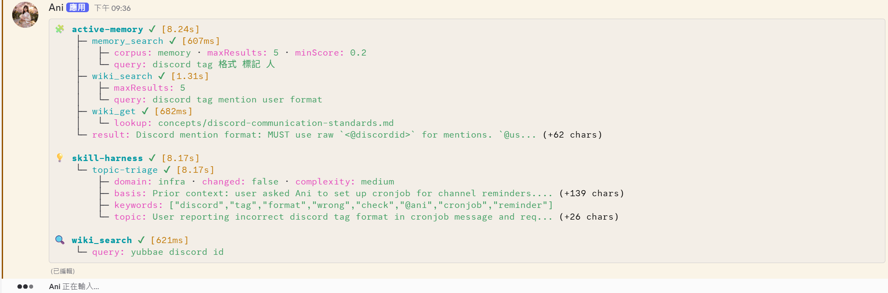

# Discord Tool Status Plugin for OpenClaw

[](https://github.com/openclaw/openclaw)
[](https://opensource.org/licenses/MIT)

Discord Tool Status is an OpenClaw plugin that shows live agent/tool activity in Discord. For each Discord conversation, it creates one YAML-formatted status message, edits that message as tools run, folds in internal `active-memory` and `skill-harness` status, then removes the status message after the agent finishes.



## What problem it solves

When an OpenClaw agent is working from Discord, long-running tool calls can otherwise look like silence. This plugin gives users and operators a lightweight progress view without changing the final assistant reply.

It helps answer:

- Is the agent currently using tools?
- Which tool or internal pipeline phase is running?
- Did a tool complete, fail, or get reconciled after arriving before a Discord session existed?
- How long did completed tools take?
- Are internal companion workflows such as `active-memory` and `skill-harness` still running?

The plugin is designed to fail open: if Discord credentials are missing or Discord API calls fail, it logs the problem and skips status updates instead of blocking the agent flow.

## What it shows

Status messages are Discord YAML code blocks. Internal subagent groups appear before normal tools:

```yaml
🧩 active-memory: ✔
   - memory_search: ✔ (120ms)
     - query: project notes
   - result: Relevant memory found

💡 skill-harness: ✔
   - intent: code-review
     reason: User asked for a review
     confidence: 0.92

🔍 web_search: ✔ (450ms)
   - query: OpenClaw plugin SDK
```

Status markers:

- `←` pending or currently visible as the latest non-final completed entry.
- `✔` completed.
- `✘` errored.
- `♻︎` orphan-reconciled after the tool result arrived before the Discord session was known.

Rendering rules to preserve:

- Normal tools render after `active-memory` and `skill-harness` groups.
- `active-memory` and `skill-harness` group order is stable.
- `skill-harness` JSON object results flatten to key-value fields.
- `skill-harness` plain text results render as `result: <text>`.
- `active-memory` result text renders as `result: <text>`.
- Tool-provided durations take precedence. When a completion omits `durationMs`, elapsed time falls back to the first observed `before_tool_call`; duplicate terminal events preserve that value instead of recalculating it.
- Durations below 1000ms render in milliseconds. Durations of 1000ms or more render as seconds rounded to the nearest whole number.
- Status output keeps up to 6 normal tool entries, 6 `active-memory` child entries, and 6 `skill-harness` child entries independently.
- Overlong status messages are trimmed to fit the configured Discord message limit.

## How it works

The plugin listens to OpenClaw runtime events and maps them to one active Discord status message per Discord conversation.

1. **`message_received`** resolves the Discord context, records channel/message metadata, and starts or replaces the active session for the conversation.
2. **`before_tool_call`** adds a pending tool entry. If the Discord session is not known yet, the tool call is stored as an orphan.
3. **`after_tool_call`** marks the matching entry completed, errored, or orphan-reconciled, preserves or derives completed duration data, and updates the status message.
4. **`before_agent_reply` / `message_sending`** finalize visible status before the final user-facing reply is sent.
5. **`agent_end`** handles main-session cleanup and captures final `active-memory` output from its internal session.
6. **`plugin:skill-harness` pipeline events** feed `skill-harness` status. The plugin intentionally ignores legacy `skill-harness` `agent_end` result rendering.

Session and race-safety behavior:

- Each session serializes Discord create/edit/delete operations through `pendingOp`.
- `generation`, `ownerSessionKey`, `finalized`, and current-session checks prevent stale events from editing a replacement session.
- Finalized sessions do not create duplicate status messages from late tool events.
- Direct-message sessions can resolve a Discord DM channel before sending.
- Codex/OpenClaw-prefixed tool names such as `openclawskill_view` display immediately as canonical names such as `skill_view`.

## Architecture

The repository is a small TypeScript plugin with focused runtime modules and colocated tests. The main runtime hotspot is `src/hooks.ts`; keep new behavior in smaller helpers when possible instead of growing hook orchestration unnecessarily.

| Path                                | Responsibility                                                                                                                                |
| ----------------------------------- | --------------------------------------------------------------------------------------------------------------------------------------------- |
| `src/plugin.ts`                     | Plugin assembly: config resolution, token resolver, companion-plugin enablement checks, shared runtime state, and hook registration.          |
| `src/hooks.ts`                      | OpenClaw hook orchestration: session routing, tool lifecycle updates, subagent placeholders/results, orphan reconciliation, and finalization. |
| `src/session.ts`                    | Discord status message lifecycle: send, edit, retire, delete, pending operation serialization, cleanup timers, and max-display handling.      |
| `src/store.ts`                      | Active session and Discord context tracking.                                                                                                  |
| `src/orphans.ts`                    | Temporary storage and lookup helpers for tool calls that arrive before a Discord session is available.                                        |
| `src/parser.ts`                     | Session-key parsing, Discord context extraction, sender/channel ID extraction, and final subagent result extraction.                          |
| `src/render.ts`                     | Pure rendering from tool history to YAML status content.                                                                                      |
| `src/formatting.ts`                 | Icons and YAML-safe parameter formatting.                                                                                                     |
| `src/tool-name.ts`                  | Shared OpenClaw/Codex tool-name canonicalization for hook dedupe and first-render display.                                                    |
| `src/skill-harness-status.ts`       | Skill-harness pipeline parsing, visible-field filtering, child duration calculation, and duplicate phase merging.                             |
| `src/discord-api.ts`                | Discord REST calls, rate-limit retry, server-error retry, network-error retry, and DM channel resolution.                                     |
| `src/discord-message-operations.ts` | Token-gated send/edit/delete functions around the Discord API layer, including DM fallback.                                                   |
| `src/tool-history-manager.ts`       | Tool-history add/update/replace/trim helpers and subagent group operations.                                                                   |
| `src/config.ts`                     | Zod-backed plugin config parsing and defaults.                                                                                                |
| `src/types.ts`                      | Shared event, session, store, and tool-entry types.                                                                                           |
| `api.ts`, `index.ts`, `token.ts`    | Plugin SDK bridge, exported plugin entrypoint, and Discord token resolution.                                                                  |

## Installation

Install the plugin package wherever your OpenClaw deployment loads local plugins, then install dependencies and build the extension:

```bash
pnpm install
pnpm run build
```

Enable the plugin in your OpenClaw plugin configuration:

```json
{
  "plugins": {
    "entries": {
      "discord-tool-status": {
        "enabled": true,
        "config": {
          "maxToolHistoryLength": 30,
          "maxDisplayMs": 600000
        }
      }
    }
  }
}
```

The plugin manifest activates on startup for the `discord` channel:

```json
{
  "activation": {
    "onStartup": true,
    "onChannels": ["discord"]
  }
}
```

Discord bot credentials are resolved through OpenClaw account/secret configuration by the plugin SDK. Keep Discord credentials in the OpenClaw Discord channel/account configuration or secret store; do not hard-code credentials in this plugin.

## Configuration

| Property                 | Type     | Default  | Description                                                        |
| ------------------------ | -------- | -------- | ------------------------------------------------------------------ |
| `maxToolHistoryLength`   | `number` | `30`     | Maximum number of tool entries retained in memory before trimming. |
| `maxStatusMessageLength` | `number` | `1700`   | Maximum rendered Discord status message length.                    |
| `maxDisplayMs`           | `number` | `600000` | Maximum time a status message may remain before force cleanup.     |
| `orphanTtlMs`            | `number` | `300000` | Time to keep orphaned tool calls while waiting for a session link. |

Runtime display limits are stricter than `maxToolHistoryLength`: the renderer keeps up to 6 normal entries, 6 `active-memory` children, and 6 `skill-harness` children in the visible status message.

## Companion workflows

Discord Tool Status is useful beside plugins that run longer tool workflows from Discord. For example, if public X/Twitter automation is handled by TweetClaw, install and configure TweetClaw separately while using Discord Tool Status for progress visibility.

Visible external actions such as posting tweets, sending replies, or direct messages should still use OpenClaw's normal approval flow. This plugin only reports progress; it does not grant approval or bypass safety controls.

## Development guide

Use `pnpm` for all local commands.

```bash
pnpm run format      # Prettier for Markdown, JSON, and TypeScript
pnpm run typecheck   # TypeScript, no emit
pnpm run test        # Full Vitest suite
pnpm run build       # Clean and compile runtime files to dist/
```

Before handing off code changes, run at least:

```bash
pnpm run format
pnpm run typecheck
pnpm run test
```

Run `pnpm run build` when changing plugin registration, package metadata, SDK imports, emitted behavior, release artifacts, or anything that depends on `dist/` output. The build uses `tsconfig.build.json` so publish output stays runtime-only.

Testing map:

- Config parsing/defaults: `src/config.test.ts`.
- Rendering behavior: `src/render.test.ts`.
- Session message lifecycle, pending operation serialization, cleanup, and DM fallback: `src/session.test.ts`.
- Store ownership/current-session behavior: `src/store.test.ts`.
- Orphan tool behavior: `src/orphans.test.ts`.
- Hook-level routing and lifecycle behavior: `src/hooks.test.ts`.
- Plugin registration and manifest-facing behavior: `src/plugin.test.ts` and `src/plugin.integration.test.ts`.
- Tool-history helper behavior: `src/tool-history-manager.test.ts`.

Package hygiene note: this package publishes `dist/`. `pnpm run build` cleans `dist/` and compiles through `tsconfig.build.json`, which includes runtime entries while excluding tests and root tooling. If you change build or release behavior, verify with `pnpm run build` and `pnpm pack --dry-run`; the tarball should not contain outputs such as `dist/vitest.config.*` or `dist/test-helpers.*`.

## Security and performance

- Discord tokens are resolved through OpenClaw configuration/secret handling.
- Discord API failures are logged and skipped so agent replies are not blocked.
- Discord REST calls retry rate limits, transient server errors, and network errors.
- Per-session message operations are serialized to avoid create/edit/delete races.
- Finalized status messages are deleted after cleanup and force-cleaned after `maxDisplayMs`.

---

Powered by Ani, Wan Jiun Wei © 2026
